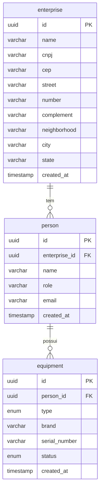

# Levantamento de Requisitos — IT Resource Manager

**Versão:** 1.0  
**Data:** 11 de junho de 2026  
**Autor:** Rhuan Kowic Santos

---

## 1. Visão Geral

O **IT Resource Manager** é uma API REST destinada ao gerenciamento de recursos de TI corporativos. O sistema permite que empresas cadastrem suas instalações, gerenciem as pessoas vinculadas a cada empresa e controlem o ciclo de vida dos equipamentos de TI atribuídos a essas pessoas.

---

## 2. Escopo

A versão 1 (v1) da API cobre três domínios principais:

| Domínio         | Descrição                                                    |
| --------------- | ------------------------------------------------------------ |
| **Enterprises** | Cadastro e gestão de empresas                                |
| **People**      | Cadastro e gestão de pessoas vinculadas a empresas           |
| **Equipments**  | Cadastro e gestão de equipamentos de TI vinculados a pessoas |

---

## 3. Modelo de Dados

### 3.1 Diagrama UML


### 3.2 Entidade: `enterprise` (Empresa)

Representa uma organização cadastrada no sistema.

| Coluna         | Tipo      | Restrição        | Descrição                          |
| -------------- | --------- | ---------------- | ---------------------------------- |
| `id`           | uuid      | PK               | Identificador único da empresa     |
| `name`         | varchar   | NOT NULL         | Razão social da empresa            |
| `cnpj`         | varchar   | NOT NULL, Unique | CNPJ da empresa                    |
| `cep`          | varchar   | NOT NULL         | CEP do endereço                    |
| `street`       | varchar   | NOT NULL         | Logradouro                         |
| `number`       | varchar   | NOT NULL         | Número do endereço                 |
| `complement`   | varchar   | —                | Complemento do endereço (opcional) |
| `neighborhood` | varchar   | NOT NULL         | Bairro                             |
| `city`         | varchar   | NOT NULL         | Cidade                             |
| `state`        | varchar   | NOT NULL         | Estado (UF)                        |
| `created_at`   | timestamp | —                | Data/hora de criação do registro   |

> [!NOTE]
> O campo `complement` é o único campo opcional da entidade `enterprise`. Todos os demais são obrigatórios.

### 3.3 Entidade: `person` (Pessoa)

Representa um colaborador ou usuário vinculado a uma empresa.

| Coluna          | Tipo      | Restrição                    | Descrição                        |
| --------------- | --------- | ---------------------------- | -------------------------------- |
| `id`            | uuid      | PK                           | Identificador único da pessoa    |
| `enterprise_id` | uuid      | FK → enterprise.id, NOT NULL | Empresa à qual a pessoa pertence |
| `name`          | varchar   | NOT NULL                     | Nome completo                    |
| `role`          | varchar   | NOT NULL                     | Cargo/função                     |
| `email`         | varchar   | NOT NULL, Unique             | Endereço de e-mail               |
| `created_at`    | timestamp | —                            | Data/hora de criação do registro |

### 3.4 Entidade: `equipment` (Equipamento)

Representa um equipamento de TI associado a uma pessoa.

| Coluna          | Tipo                    | Restrição        | Descrição                           |
| --------------- | ----------------------- | ---------------- | ----------------------------------- |
| `id`            | uuid                    | PK               | Identificador único do equipamento  |
| `person_id`     | uuid                    | FK → person.id   | Pessoa responsável pelo equipamento |
| `type`          | equipment_type (Enum)   | NOT NULL         | Tipo do equipamento                 |
| `brand`         | varchar                 | NOT NULL         | Marca do equipamento                |
| `serial_number` | varchar                 | NOT NULL, Unique | Número de série                     |
| `status`        | equipment_status (Enum) | NOT NULL         | Status atual do equipamento         |
| `created_at`    | timestamp               | —                | Data/hora de criação do registro    |

### 3.5 Tipos Enumerados

#### `equipment_type` — Tipo de Equipamento

Os valores possíveis deste enum devem representar categorias de hardware de TI, como:

- `NOTEBOOK`
- `DESKTOP`
- `MONITOR`
- `TECLADO`
- `MOUSE`
- _(a definir conforme necessidade do negócio)_

#### `equipment_status` — Status do Equipamento

Os valores possíveis deste enum controlam o ciclo de vida do equipamento:

- `available` — Disponível para uso
- `in_use` — Em uso por uma pessoa
- `under_maintenance` — Em manutenção
- `decommissioned` — Desativado/descartado
- _(a definir conforme necessidade do negócio)_

### 3.6 Relacionamentos



---

## 4. Rotas da API (v1)

### 4.1 Diagrama de Rotas


### 4.2 Módulo: Enterprises

Base path: `/enterprises`

| Método   | Rota               | Descrição                                  |
| -------- | ------------------ | ------------------------------------------ |
| `GET`    | `/enterprises`     | Lista todas as empresas cadastradas        |
| `GET`    | `/enterprises/:id` | Retorna os dados de uma empresa específica |
| `POST`   | `/enterprises`     | Cria uma nova empresa                      |
| `PUT`    | `/enterprises/:id` | Atualiza os dados de uma empresa           |
| `DELETE` | `/enterprises/:id` | Remove uma empresa do sistema              |

### 4.3 Módulo: People

Base path: `/people`

| Método   | Rota          | Descrição                                 |
| -------- | ------------- | ----------------------------------------- |
| `GET`    | `/people`     | Lista todas as pessoas cadastradas        |
| `GET`    | `/people/:id` | Retorna os dados de uma pessoa específica |
| `POST`   | `/people`     | Cria uma nova pessoa                      |
| `PUT`    | `/people/:id` | Atualiza os dados de uma pessoa           |
| `DELETE` | `/people/:id` | Remove uma pessoa do sistema              |

### 4.4 Módulo: Equipments

Base path: `/equipments`

| Método   | Rota                           | Descrição                                                 |
| -------- | ------------------------------ | --------------------------------------------------------- |
| `GET`    | `/equipments`                  | Lista todos os equipamentos cadastrados                   |
| `GET`    | `/equipments/:id`              | Retorna os dados de um equipamento específico             |
| `GET`    | `/equipments?status=available` | Lista apenas equipamentos disponíveis (filtro por status) |
| `POST`   | `/equipments`                  | Cadastra um novo equipamento                              |
| `PUT`    | `/equipments/:id`              | Atualiza os dados de um equipamento                       |
| `DELETE` | `/equipments/:id`              | Remove um equipamento do sistema                          |

> [!IMPORTANT]
> O módulo de Equipments possui uma rota de filtro exclusiva: `GET /equipments?status=available`. Isso indica que a filtragem por status é um caso de uso prioritário, sugerindo que outros filtros por status também podem ser suportados via query param (`?status=<valor>`).

---

## 5. Requisitos Funcionais

### RF-01 — Gestão de Empresas

| ID      | Requisito                                                                               |
| ------- | --------------------------------------------------------------------------------------- |
| RF-01.1 | O sistema deve permitir o cadastro de uma nova empresa com todos os campos obrigatórios |
| RF-01.2 | O sistema deve listar todas as empresas cadastradas                                     |
| RF-01.3 | O sistema deve permitir a consulta de uma empresa pelo seu `id`                         |
| RF-01.4 | O sistema deve permitir a atualização dos dados de uma empresa existente                |
| RF-01.5 | O sistema deve permitir a exclusão de uma empresa pelo seu `id`                         |
| RF-01.6 | O CNPJ da empresa deve ser único no sistema                                             |

### RF-02 — Gestão de Pessoas

| ID      | Requisito                                                                                                       |
| ------- | --------------------------------------------------------------------------------------------------------------- |
| RF-02.1 | O sistema deve permitir o cadastro de uma pessoa, vinculando-a obrigatoriamente a uma empresa (`enterprise_id`) |
| RF-02.2 | O sistema deve listar todas as pessoas cadastradas                                                              |
| RF-02.3 | O sistema deve permitir a consulta de uma pessoa pelo seu `id`                                                  |
| RF-02.4 | O sistema deve permitir a atualização dos dados de uma pessoa existente                                         |
| RF-02.5 | O sistema deve permitir a exclusão de uma pessoa pelo seu `id`                                                  |
| RF-02.6 | O e-mail de uma pessoa deve ser único no sistema                                                                |

### RF-03 — Gestão de Equipamentos

| ID      | Requisito                                                                                           |
| ------- | --------------------------------------------------------------------------------------------------- |
| RF-03.1 | O sistema deve permitir o cadastro de um equipamento, podendo vinculá-lo a uma pessoa (`person_id`) |
| RF-03.2 | O sistema deve listar todos os equipamentos cadastrados                                             |
| RF-03.3 | O sistema deve permitir a consulta de um equipamento pelo seu `id`                                  |
| RF-03.4 | O sistema deve permitir a filtragem de equipamentos por status (ex.: `available`) via query string  |
| RF-03.5 | O sistema deve permitir a atualização dos dados de um equipamento existente                         |
| RF-03.6 | O sistema deve permitir a exclusão de um equipamento pelo seu `id`                                  |
| RF-03.7 | O número de série (`serial_number`) de um equipamento deve ser único no sistema                     |

---

## 6. Requisitos Não-Funcionais

| ID     | Requisito                                                                                                                  |
| ------ | -------------------------------------------------------------------------------------------------------------------------- |
| RNF-01 | Todos os identificadores primários e estrangeiros devem ser do tipo UUID                                                   |
| RNF-02 | A API deve seguir o estilo arquitetural REST                                                                               |
| RNF-03 | As respostas da API devem ser no formato JSON                                                                              |
| RNF-04 | Os timestamps de criação (`created_at`) devem ser gerados automaticamente pelo banco de dados                              |
| RNF-05 | A API deve responder com códigos HTTP semânticos (2xx para sucesso, 4xx para erros do cliente, 5xx para erros do servidor) |
| RNF-06 | Campos com restrição `NOT NULL` devem ser validados antes da persistência, retornando erro 400 em caso de ausência         |

---

## 7. Regras de Negócio

| ID    | Regra                                                                                                                                              |
| ----- | -------------------------------------------------------------------------------------------------------------------------------------------------- |
| RN-01 | Não é possível cadastrar uma pessoa sem informar uma empresa válida (`enterprise_id` existente)                                                    |
| RN-02 | Um equipamento pode existir sem estar vinculado a uma pessoa (campo `person_id` pode ser nulo), representando um equipamento disponível no estoque |
| RN-03 | Um equipamento com `status = available` é elegível para atribuição a uma pessoa                                                                    |
| RN-04 | O CNPJ deve ser único por empresa no sistema                                                                                                       |
| RN-05 | O e-mail deve ser único por pessoa no sistema                                                                                                      |
| RN-06 | O número de série deve ser único por equipamento no sistema                                                                                        |
| RN-07 | A exclusão de uma empresa pode ser bloqueada se houver pessoas vinculadas a ela (integridade referencial)                                          |
| RN-08 | A exclusão de uma pessoa pode ser bloqueada se houver equipamentos vinculados a ela (integridade referencial)                                      |

---

## 8. Estrutura de Payloads (Exemplos)

### 8.1 POST /enterprises

```json
{
  "name": "Tech Corp Ltda",
  "cnpj": "12.345.678/0001-99",
  "cep": "01310-100",
  "street": "Avenida Paulista",
  "number": "1000",
  "complement": "Andar 10",
  "neighborhood": "Bela Vista",
  "city": "São Paulo",
  "state": "SP"
}
```

### 8.2 POST /people

```json
{
  "enterprise_id": "uuid-da-empresa",
  "name": "João da Silva",
  "role": "Analista de TI",
  "email": "joao.silva@techcorp.com"
}
```

### 8.3 POST /equipments

```json
{
  "person_id": "uuid-da-pessoa",
  "type": "NOTEBOOK",
  "brand": "Dell",
  "serial_number": "SN-2024-00123",
  "status": "in_use"
}
```

---

## 9. Glossário

| Termo                | Definição                                                                                   |
| -------------------- | ------------------------------------------------------------------------------------------- |
| **UUID**             | Universally Unique Identifier — identificador único universal utilizado como chave primária |
| **CNPJ**             | Cadastro Nacional da Pessoa Jurídica — documento de identificação de empresas no Brasil     |
| **CEP**              | Código de Endereçamento Postal                                                              |
| **equipment_type**   | Enum que define a categoria do equipamento (ex.: Notebook, Desktop)                         |
| **equipment_status** | Enum que define o estado atual do equipamento (ex.: disponível, em uso)                     |
| **REST**             | Representational State Transfer — estilo arquitetural para APIs web                         |
| **PK**               | Primary Key — chave primária da tabela                                                      |
| **FK**               | Foreign Key — chave estrangeira referenciando outra tabela                                  |

---

## 10. Observações e Pontos em Aberto

> [!WARNING]
> Os itens abaixo requerem definição antes da implementação completa:

1. **Valores dos enums** (`equipment_type` e `equipment_status`): Os valores exatos precisam ser definidos pela equipe de negócio.
2. **Autenticação/Autorização**: O documento atual não menciona mecanismos de autenticação (JWT, API Key, OAuth). Definir se a API será pública ou protegida.
3. **Paginação**: As rotas de listagem (`GET /enterprises`, `GET /people`, `GET /equipments`) devem suportar paginação? Definir parâmetros (`page`, `limit`, `offset`).
4. **Filtros adicionais**: Além de `?status=available`, outros filtros devem ser suportados? (ex.: filtrar equipamentos por `person_id`, pessoas por `enterprise_id`).
5. **Soft Delete vs Hard Delete**: As operações `DELETE` removem o registro fisicamente ou utilizam uma flag `deleted_at` (soft delete)?
6. **Validação de CNPJ e CEP**: O sistema deve validar o formato/existência do CNPJ e CEP via regras de negócio ou serviços externos?
